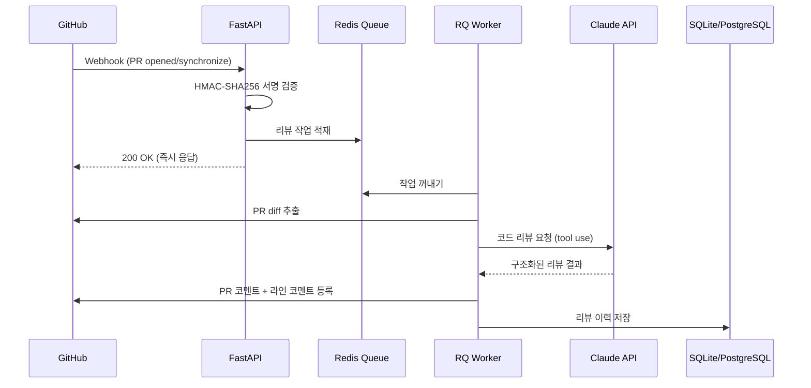
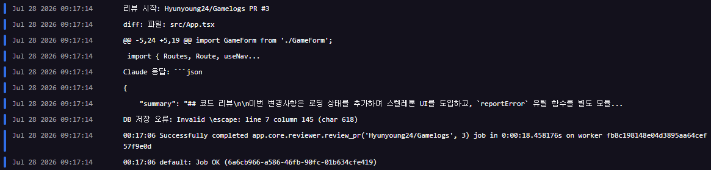

# GitReviewer
GitHub PR이 열리면 Claude AI가 자동으로 코드를 리뷰하고 라인 코멘트를 달아주는 봇

## 작동 방식
1. GitHub 저장소에 PR이 열리거나 커밋이 추가되면
2. GitHub webhook이 FastAPI 서버로 이벤트를 전송하고 (`app/main.py`)
3. HMAC-SHA256 서명 검증 후 Redis 큐에 작업 적재
4. RQ 워커가 큐에서 작업을 꺼내 PR의 diff를 추출하고 (`worker.py` > `app/core/reviewer.py`)
5. Claude API로 코드 리뷰를 요청
6. 결과를 GitHub PR 라인 코멘트 + 요약 댓글로 등록하고 DB에 저장 (`app/core/reviewer.py`)
7. 웹 대시보드에서 리뷰 이력 확인 (`app/api/dashboard.py`)

## 아키텍처



## 기술 스택

| 영역 | 기술 | 이유 |
|------|------|------|
| 백엔드 | FastAPI | 비동기 웹훅 수신에 최적 |
| LLM | Claude API (Sonnet 4.6) | 코드 이해도 최상, 긴 컨텍스트 처리 |
| 비동기 처리 | Redis + RQ | GitHub 웹훅 10초 타임아웃 방지 |
| DB | SQLite | 리뷰 이력 저장 |
| 프론트 | Chart.js | 리뷰 통계 시각화 |

## Claude를 선택한 이유
- 코드 리뷰는 긴 diff 이해와 정확한 버그 탐지가 핵심
- Claude는 코드 이해도가 LLM 중 최상위 수준이며 200K 토큰의 긴 컨텍스트를 처리할 수 있어 대규모 PR도 분석 가능

## 보안
- **WEBHOOK_SECRET** (필수): GitHub 웹훅 서명 검증에 사용됩니다. 미설정 시 모든 웹훅 요청이 거부(401)됩니다.
- **CONFIG_TOKEN** (권장): 대시보드 설정 API(`/config`) 인증에 사용됩니다. 미설정 시 누구나 리뷰 설정을 변경할 수 있으므로, 외부에 서버를 노출하는 경우 반드시 설정하세요.

토큰 생성 예시:
```bash
python -c "import secrets; print(secrets.token_urlsafe(32))"
```

## 트러블슈팅
### GitHub 웹훅 타임아웃
- Claude API 응답이 수 초에서 수십 초 걸려서 GitHub 웹훅 10초 타임아웃에 걸리는 문제
- Redis 큐를 도입해 웹훅 수신 즉시 200 응답을 보내고, 워커가 백그라운드에서 처리하는 구조로 해결

### 타이밍 공격 방지
- `==` 비교는 앞글자부터 하나씩 비교하다가 다른 글자를 만나면 false를 반환하기에 응답 시간으로 몇 글자까지 맞았는지 추측 가능
- `hmac.compare_digest()` 로 서명 전체를 비교하는 것으로 해결

### 할루시네이션
- Claude가 현재 날짜를 과거로 인식하는 문제
- `import datetime` 후 프롬프트에 오늘 날짜를 명시적으로 포함시켜 해결

### 중복 리뷰 방지
- 같은 PR에 커밋이 추가될 때마다 리뷰가 중복 생성
- 커밋 SHA와 PR 번호로 중복 리뷰 여부를 파악해서 이미 리뷰했을 경우 건너뛰게 처리해서 해결

### 웹훅 위조 요청 차단
- WEBHOOK_SECRET이 설정되지 않았을 때 서명 검증을 건너뛰고 모든 요청을 수락하던 문제
- WEBHOOK_SECRET이 비어 있으면 검증 자체를 실패 처리(`return False`)하도록 변경해, 시크릿 없이는 웹훅이 동작하지 않게 해결

### 설정 API 무단 접근
- `/config` 엔드포인트가 인증 없이 노출되어 누구나 설정을 조회/변경할 수 있던 문제
- `CONFIG_TOKEN` 환경변수 기반 Bearer 토큰 인증을 추가하고, `hmac.compare_digest()`로 타이밍 공격까지 방지하여 해결

### JSON 파싱 실패로 인한 리뷰 누락
- diff에 백슬래시(윈도우 경로, 정규식 등)가 포함되면 Claude가 응답 JSON에서 이스케이프를 빠뜨려 `json.loads`가 `Invalid \escape` 오류로 실패, 리뷰가 조용히 누락되는 문제

  

- 프롬프트로 JSON 형식을 요청하고 텍스트를 직접 파싱하던 방식 대신, Claude API의 tool use(함수 호출)로 구조화된 출력을 강제해 해결; Anthropic 쪽에서 JSON을 직접 파싱해 전달하므로 이스케이프 문제 자체가 발생하지 않음

## 사용법
### 사전 준비
- [ngrok](https://ngrok.com) 설치 및 계정 연동
- [Docker Desktop](https://www.docker.com/products/docker-desktop/) 다운로드
- (GUI 사용시 선택사항) WSL, Redis 설치
```bash
wsl --install -d Ubuntu
sudo apt-get install redis-server
sudo service redis-server start
```

### GitHub 웹훅 등록
1. 리뷰받을 GitHub 저장소 → Settings → Webhooks → Add webhook
2. Payload URL: ngrok URL(`https://ngrok주소/webhook`)
3. Content type: `application/json`
4. Secret: 자신만 아는 임의의 문자열 (GUI 사용시 'GitHub 리포지토리용 웹훅 시크릿')
5. Events: **Pull requests** 선택
6. Add webhook 클릭

### 실행
#### GUI / .exe (권장 1)
```bash
# 1. 최신 GitReviewer.exe 다운로드
```
[Releases](https://github.com/Hyunyoung24/GitReviewer/releases)
```bash
# 2. GitReviewer.exe 실행, 설정 후 저장
Anthropic API 키: 클로드 API 키
GitHub 개인 접근용 토큰: 해당 리포지토리 접근 가능한 토큰
GitHub 리포지토리용 웹훅 시크릿: 웹훅 Secret 값
API 요청 헤더용 토큰 (비밀번호): 자신만 아는 임의의 문자열

# 3. 실행 버튼 클릭
```

#### GUI / .py (권장 2)
```bash
# 1. 리포지토리 다운로드

# 2. GitReviewer.py 실행
python GitReviewer.py

# 3. 설정 후 저장
Anthropic API 키: 클로드 API 키
GitHub 개인 접근용 토큰: 해당 리포지토리 접근 가능한 토큰
GitHub 리포지토리용 웹훅 시크릿: 웹훅 Secret 값
API 요청 헤더용 토큰 (비밀번호): 자신만 아는 임의의 문자열

# 4. 실행 버튼 클릭
```

#### Docker
```bash
# 1. ngrok 토큰 입력
ngrok config add-authtoken [토큰]

# 2. 환경변수 설정 (.env)
ANTHROPIC_API_KEY=클로드 API 키
GITHUB_TOKEN=해당 리포지토리 접근 가능한 토큰
WEBHOOK_SECRET=웹훅 Secret 값
CONFIG_TOKEN=대시보드 설정 API 인증용 토큰 (비밀번호)
REDIS_URL=redis://redis:6379

# 3. DB 초기화
python -m app.init_db

# 4. 실행 (FastAPI + Redis + Worker)
docker-compose up --build
```

#### 로컬에서 직접 실행
```bash
# 1. ngrok 토큰 입력
ngrok config add-authtoken [토큰]

# 2. 패키지 설치
pip install -r requirements.txt

# 3. 환경변수 설정 (.env)
ANTHROPIC_API_KEY=클로드 API 키
GITHUB_TOKEN=해당 리포지토리 접근 가능한 토큰
WEBHOOK_SECRET=웹훅 Secret 값
CONFIG_TOKEN=대시보드 설정 API 인증용 토큰 (비밀번호)
REDIS_URL=redis://localhost:6379

# 4. DB 초기화
python -m app.init_db

# 5. 서버 실행
uvicorn app.main:app --reload --port 8000

# 6. 워커 실행
python worker.py

# 7. ngrok으로 외부 노출
ngrok http 8000

# 8. 대시보드 실행
http://127.0.0.1:8000/dashboard_page
```

## 추후 계획
- ~~**카테고리 분류**: 버그/스타일/성능/보안으로 리뷰 코멘트를 자동 분류하고 대시보드에 통계 표시~~
- ~~**Docker화**: docker-compose로 FastAPI + Redis + Worker를 한 번에 구동~~
- **파일별 분리 리뷰**: 대용량 PR에서 파일 단위로 Claude를 따로 호출해 정확도 향상
- ~~**PostgreSQL 전환**: 배포 환경에서 SQLite → PostgreSQL로 전환~~
- **(선택) GitHub App 전환**: 현재는 저장소별 수동 웹훅 등록 방식이지만, GitHub App으로 전환하면 누구나 설치해서 쓸 수 있는 서비스로 확장 가능
- **(선택) Java로 재구축**: Spring Boot 기반으로 재구축해서 Java/Spring 생태계 경험 확장